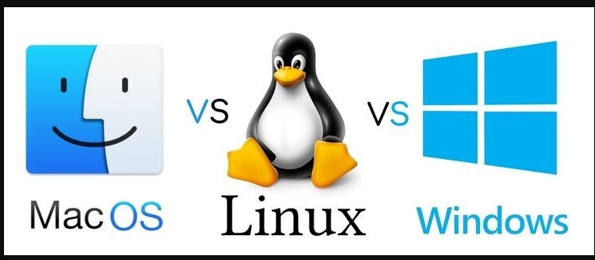

# Kapan Sebaiknya Menggunakan Windows vs Linux vs macOS?
Analisis berdasarkan use case: gaming, development, server, creative work, dan enterprise

## 1. gaming
### Windows → Pilihan Terbaik untuk Gaming

1.Dukungan game paling lengkap (terutama AAA).
2.Support DirectX dan driver GPU (NVIDIA/AMD) paling optimal.
3.Kompatibilitas tinggi dengan launcher seperti Steam, Epic, dll.

Contoh OS:
Windows 11

### Linux → Cocok untuk pengguna teknis

-Steam + Proton sudah mendukung banyak game.
-Performa bagus untuk beberapa game.
-Tapi masih ada game anti-cheat yang tidak kompatibel.

Contoh distro:
Ubuntu

### macOS → Kurang cocok

-Game sangat terbatas.
-Banyak developer game tidak merilis versi macOS.

Contoh OS:
macOS

## 2. Development (Programming)
### Linux → Sangat Ideal untuk Developer

-Native environment untuk server (Linux-based).
-Mudah install tools seperti Node.js, Python, Docker.
-Terminal sangat powerful.

Contoh:
Ubuntu
Cocok untuk: Web dev, backend, DevOps, cybersecurity.

### macOS → Favorit Developer Profesional

-Berbasis Unix (mirip Linux).
-Wajib untuk iOS development (Xcode hanya di macOS).
-Stabil dan optimal untuk development environment.

Contoh:
macOS
Cocok untuk: Web dev, mobile dev (iOS), software engineer profesional.

### Windows → Baik, tapi bukan yang paling natural

-Cocok untuk .NET dan ekosistem Microsoft.
-Sekarang ada WSL (Windows Subsystem for Linux).

Contoh:
Windows 11
Cocok untuk: .NET developer, game dev (Unity/Unreal).

## 3. Server
### Linux → Standar Industri Server

-Stabil dan ringan.
-Open-source dan gratis.
-Digunakan di mayoritas web server dunia.

Contoh distro server:
Ubuntu Server

### Windows Server → Untuk Enterprise tertentu

-Cocok untuk Active Directory dan sistem internal perusahaan.
-Terintegrasi dengan ekosistem Microsoft.

Contoh:
Windows Server

### macOS → Tidak umum untuk server
Jarang digunakan sebagai server production.

## 4. Creative Work (Desain, Editing, Musik, Video)
### macOS → Industri Kreatif

-Optimal untuk desain, video editing, dan musik.
-Banyak software kreatif populer tersedia di macOS.
-Stabil dan optimal dengan hardware Apple.

Contoh:
macOS
Cocok untuk: Video editor, graphic designer, music producer.

### Windows → Alternatif kuat

-Mendukung Adobe, Blender, dll.
-Hardware lebih fleksibel (bisa rakit PC powerful).

Contoh:
Windows 11

### Linux → Terbatas

-Ada alternatif open-source (GIMP, Kdenlive).
-Tapi tidak semua software profesional tersedia.

Contoh:
Ubuntu

## 5. Enterprise (Perusahaan & Bisnis)
### Windows → Dominan di Perkantoran

-Integrasi Microsoft Office, Active Directory.
-Mudah digunakan user umum.

Contoh:
Windows 11

### Linux → Backend & Infrastruktur

-Dipakai untuk server perusahaan.
-Aman dan stabil.

Contoh:
Ubuntu

### macOS → Biasanya untuk tim kreatif atau developer

-Tidak umum sebagai sistem utama perusahaan besar (kecuali perusahaan kreatif/tech).

Contoh:
macOS
