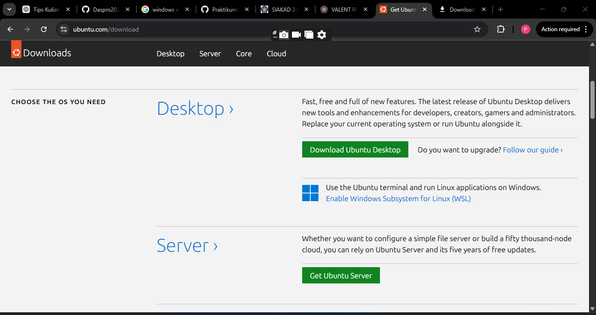
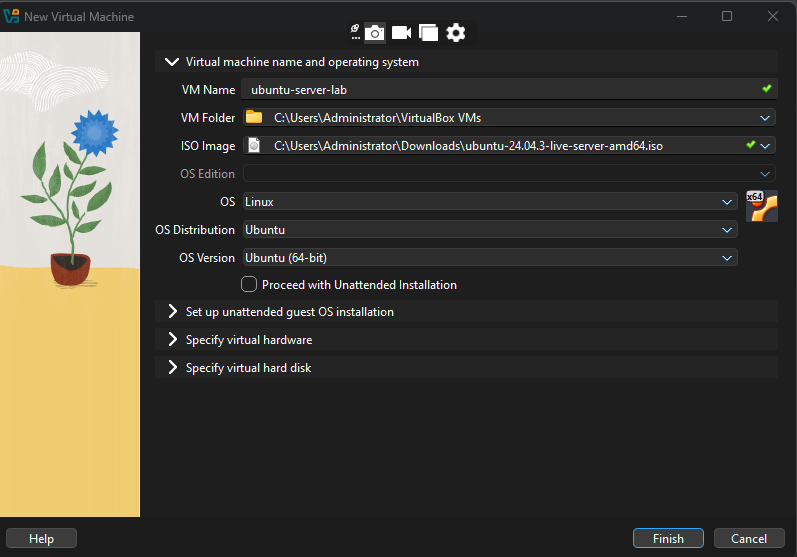
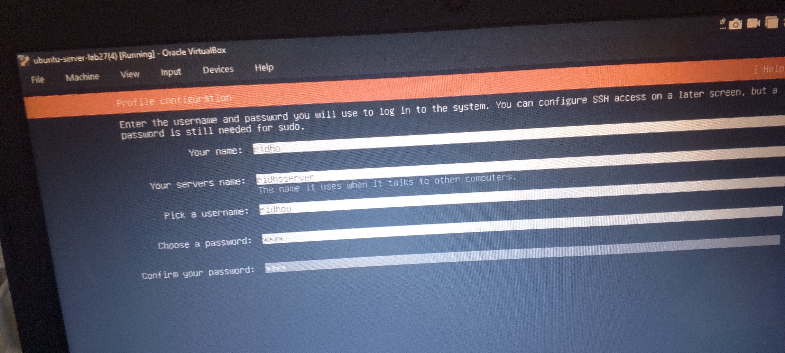
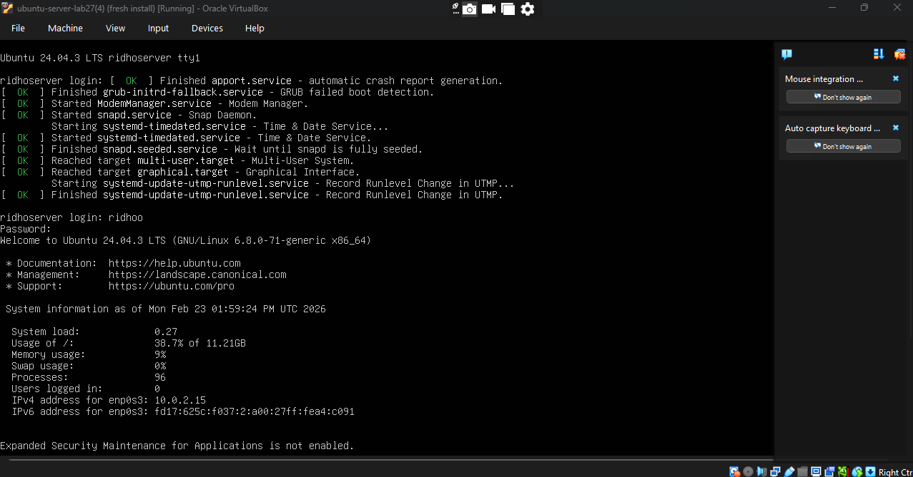
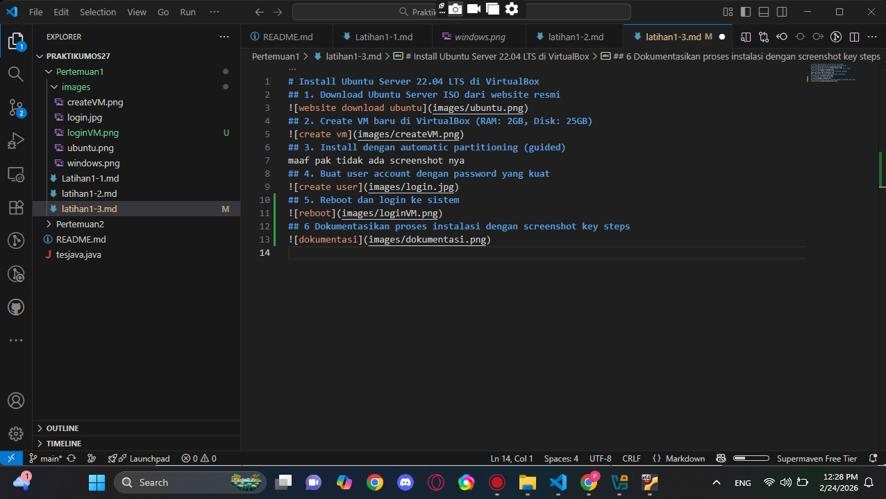

# Install Ubuntu Server 22.04 LTS di VirtualBox
## 1. Download Ubuntu Server ISO dari website resmi

## 2. Create VM baru di VirtualBox (RAM: 2GB, Disk: 25GB)

## 3. Install dengan automatic partitioning (guided)
maaf pak tidak ada screenshot nya 
## 4. Buat user account dengan password yang kuat

## 5. Reboot dan login ke sistem

## 6 Dokumentasikan proses instalasi dengan screenshot key steps

