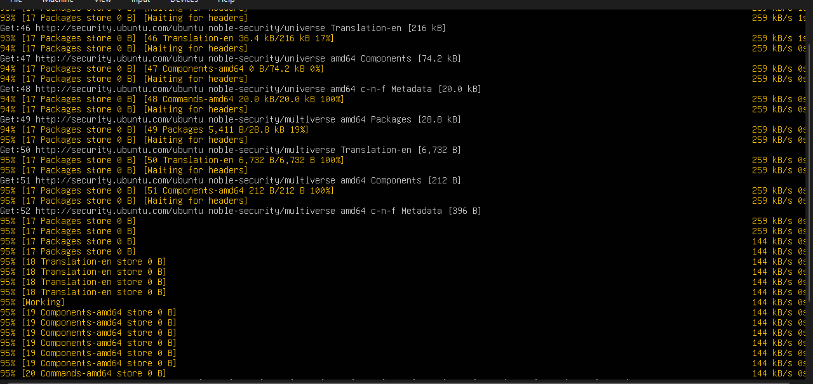
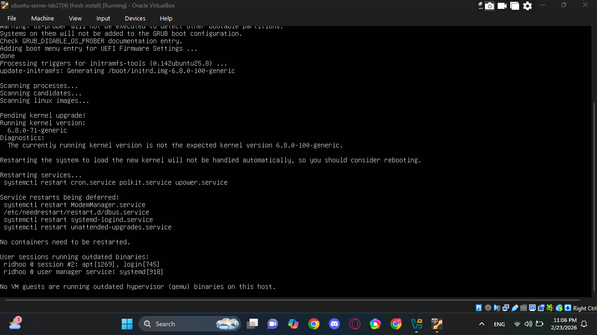
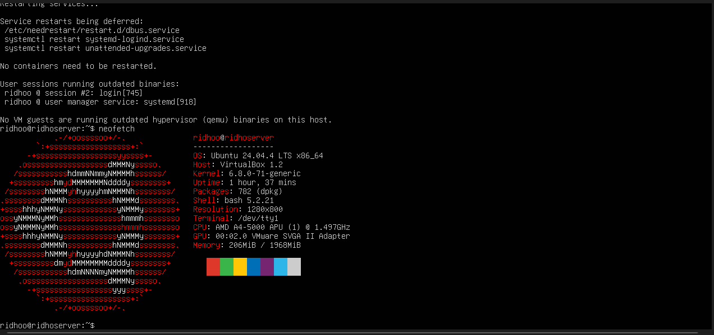
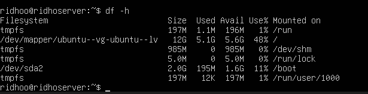
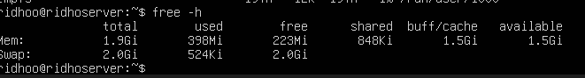

# Setelah instalasi Ubuntu Server, lakukan tasks berikut:

## 1. Update package list: sudo apt update

## 2. Upgrade packages: sudo apt upgrade

## 3. Install neofetch: sudo apt install neofetch lalu Jalankan neofetch dan screenshot hasilnya

## 4. Check disk usage dengan df -h

## 5. Check memory dengan free -h 

