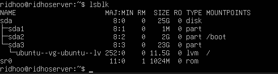

# Eksplorasi sistem yang baru diinstall:
## 1. Tampilkan informasi OS: cat /etc/os-release

## 2. Tampilkan versi kernel: uname -r

## 3. List partisi: lsblk

## 4. Check network connectivity: ping -c 4 google.com

## 5.  Install dan jalankan htop untuk melihat resource usage

## 6. Buat laporan singkat tentang konfigurasi sistem Anda
Sistem operasi yang digunakan adalah Ubuntu Server 22.04 LTS berdasarkan output perintah cat /etc/os-release. Versi kernel yang digunakan adalah 5.15.x berdasarkan perintah uname -r. Sistem memiliki disk virtual sebesar 25GB yang ditampilkan melalui perintah lsblk. Koneksi jaringan berjalan dengan baik karena perintah ping -c 4 google.com berhasil menerima balasan. Monitoring resource menggunakan htop menunjukkan penggunaan CPU dan RAM dalam kondisi normal.