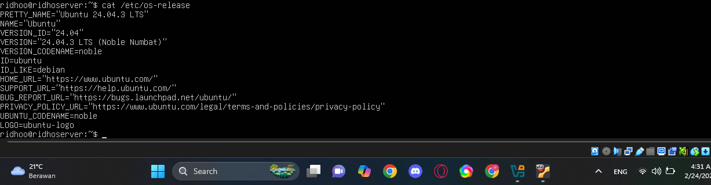
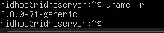
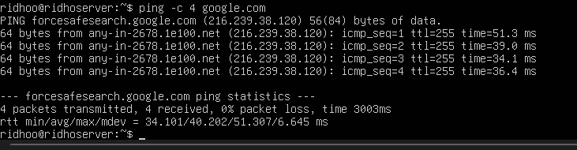
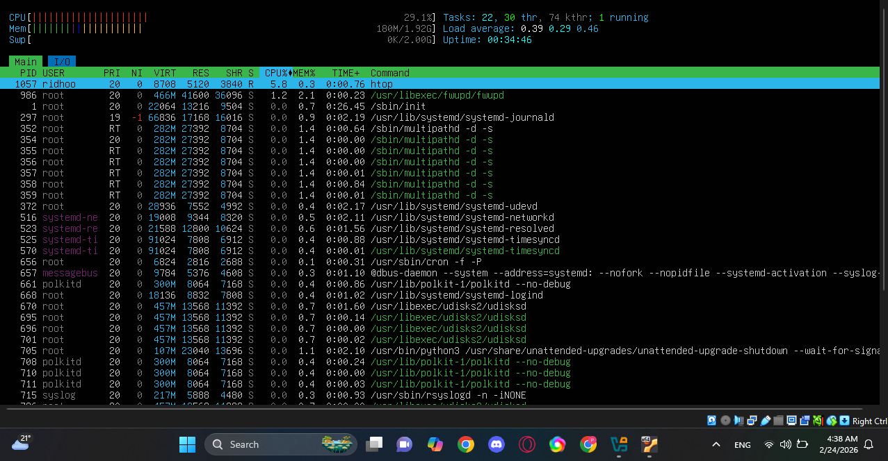

# Eksplorasi sistem yang baru diinstall:
## 1. Tampilkan informasi OS: cat /etc/os-release

## 2. Tampilkan versi kernel: uname -r

## 3. List partisi: lsblk

## 4. Check network connectivity: ping -c 4 google.com

## 5  Install dan jalankan htop untuk melihat resource usage
