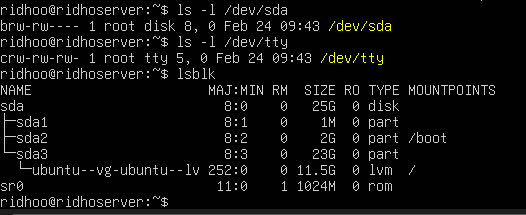

# Praktikum 2.6 — Mengenali Block vs Character Device

## langkah - langkah :
1. tulis kode ini di ubuntu server:
```
ls -l / dev / sda
```
2. lalu tulis kode ini di ubuntu server:
```
ls -l /dev/tty
```
3. Lihat disk dan partisi untuk mengaitkan dengan /dev:
```
lsblk
```
maka hasil outputnya seperti ini:


## KESIMPULAN
Pada output ls -l, karakter pertama menunjukkan tipe file. Huruf b menandakan block device, yaitu perangkat yang membaca dan menulis data dalam bentuk blok seperti hard disk. Huruf c menandakan character device, yaitu perangkat yang mentransfer data secara berurutan seperti keyboard atau terminal.

