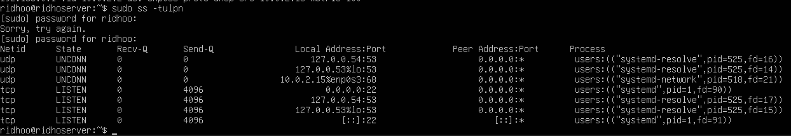

# Monitoring Port dan Koneksi (Network Basics)
## 1. Gunakan perintah ini
```
sudo ss -tulpn
```
### Output


### penjelasan perintah:
*-t → TCP
*-u → UDP
*-l → listening
*-p → tampilkan process
*-n → tampilkan nomor port (bukan nama service)

## 2. lihat service/proses yang sedang berjalan di salah satu port
kita disini akan melihat service/proses yang sedang berjalan di port 22

Bagian ini:
``` 
("systemd",pid=1,fd=90)
```
### Artinya:
*Nama proses: systemd
*PID: 742
*FD: file descriptor
Jadi:

✅ Port 22 dibuka oleh proses 

## Kegunaan port tersebut:
Port 22 digunakan oleh systemd untuk remote login ke server secara aman.
