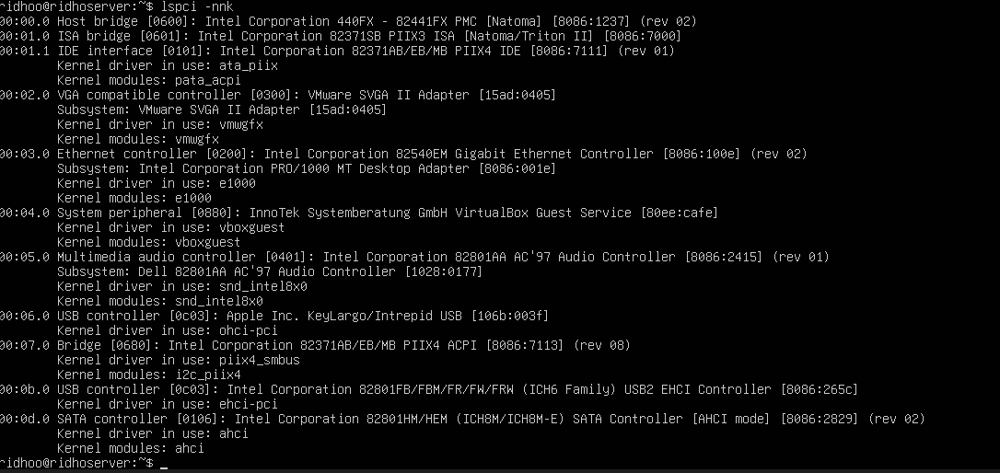
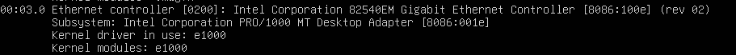

# Melihat informasi perangkat PCI dengan lspci -nnk.
## 1. Jalankan Perintah
Di Ubuntu Server ketik:
```
lspci -nnk
```
lalu harusnya muncul seperti ini :


## 2.Cara Mengambil Jawaban
saya akan mengambil salah satu perangkat PCI yang ada di sistem, yaitu perangkat PCI dengan vendor:device ID 8086:100e

### Cara Membacanya:
berikut format umum output nya:
```
[Nama perangkat] [vendorID:deviceID]
Kernel driver in use: [driver]
```
### JAWABAN:
* Nama Perangkat: Intel Corporation 82540EM Gigabit Ethernet Controller
* ID vendor:device: 8086:001e
* Kernel driver in use: e1000

