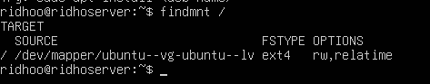
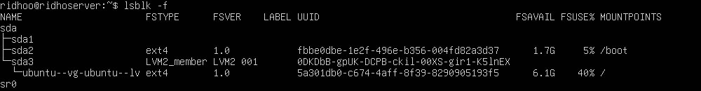
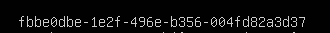

# Root Filesystem
## LANGKAH 1 — Cari Root Filesystem
ketik: 
```
findmnt / 
```
lalu hasilnya seperti ini:


### Dari sini kita dapat:
* Device root = /dev/mapper/ubuntu--vg-ubuntu--lv
* Tipe filesystem = ext4

## LANGKAH 2 — Cocokkan dengan lsblk -f
ketik:
```
lsblk -f
```
lalu hasilnya seperti ini:


### Dari sini kita dapat:
* Root filesystem berada pada device /dev/mapper/ubuntu--vg-ubuntu--lv
* Tipe filesystem yang digunakan adalah ext4.
* UUID dari filesystem tersebut adalah:



