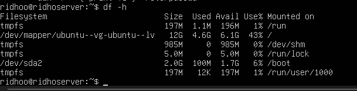

# menampilkan filesystem yang penggunaan disk di atas 70%
Setelah menjalankan perintah df -h, tidak ditemukan filesystem dengan penggunaan disk di atas 70%. Hal ini berarti kondisi penggunaan disk masih dalam batas aman.

