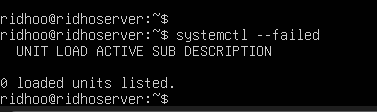
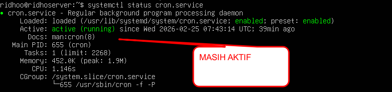
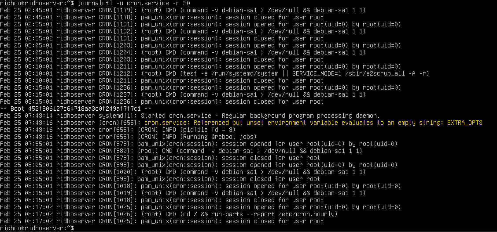
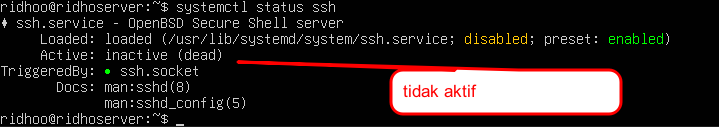

# Pemeriksaan Service dengan systemctl
## 1. Mengecek Service yang Gagal
ketik perintah :
```
systemctl --failed
```
Jika tidak ada service yang gagal, maka akan muncul pesan bahwa tidak ada unit yang bermasalah seperti ini :


## 2. Memilih Service Aktif (Contoh: cron.service)
Untuk melihat status service cron.service, ketik perintah:
```
systemctl status cron.service
```
Perintah ini menampilkan:
* Status service (active/running)
* PID proses
* Informasi singkat kondisi service

Jika status menunjukkan active (running) seperti ini:

berarti service berjalan dengan normal.

## 3. Menampilkan 30 Baris Log Terakhir
Gunakan perintah:
```
journalctl -u cron.service -n 30
```
Penjelasan:
* -u cron.service → memilih service cron.service
* -n 30 → menampilkan 30 baris log terakhir

Log ini berguna untuk troubleshooting jika terjadi masalah pada service.




## NOTE:alasan saya mengecek cron.service dan bukan service ssh,itu karena service ssh tidak aktif:

