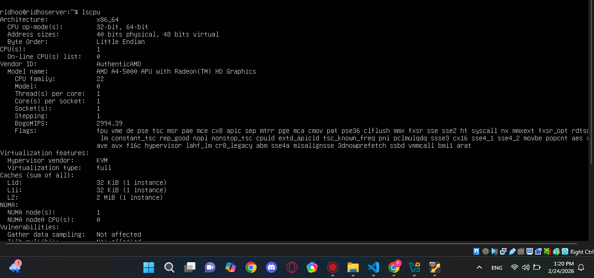
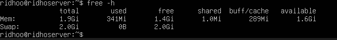

#  Identifikasi CPU dan Memori
## 1. Menampilkan informasi tentang CPU (S), core/thread :
```
lscpu
```


-CPU(s) → 1
-Core(s) per socket → 1
-Thread(s) per core → 1

## 2. Tampilkan ringkasan memori:
```
free -h
```



-Total ram → 1.91 GB
-Total swap → 2 GB

## 3. Jelaskan perbedaan RAM vs swap dalam 2–3 kalimat.
bedanya RAM adalah memori yang digunakan untuk menampung data dan program, sedang swap adalah memori yang digunakan untuk menampung data yang tidak perlu lagi, karena data ini sudah digunakan oleh program.