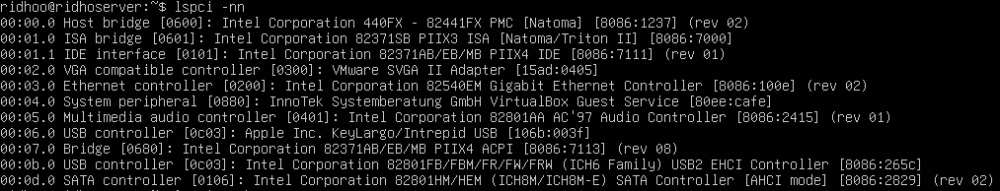
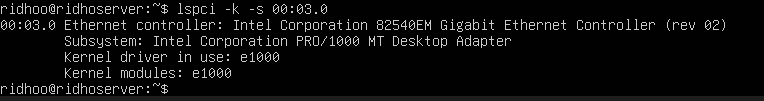

# Praktikum 2.2 — Identifikasi Perangkat PCI/USB dan Driver
Temukan 1 perangkat PCI (misal NIC) dan tuliskan: Vendor:Device ID (angka
heksadesimal), nama driver/modul kernel, dan deskripsi singkat fungsinya.

## LANGKAH 1 — Lihat Daftar Perangkat PCI
Di Ubuntu Server ketik:
```
lspci -nn
```

Contoh output biasanya seperti ini di VirtualBox:
```
00:03.0 Ethernet controller [0200]: Intel Corporation 82540EM Gigabit Ethernet Controller [8086:100e]
```
## LANGKAH 2 — Cari Driver yang Dipakai
Sekarang kita cek driver yang digunakan perangkat itu.
Ambil bagian alamat PCI di depan, misalnya:
```
00:03.0
```

Lalu ketik:
```
lspci -k -s 00:03.0
```

Contoh output:


Kernel driver in use: e1000
Kernel modules: e1000

Nah ini yang saya ambil =
```
Driver / modul kernel: e1000
```

## KESIMPULAN
Perangkat PCI yang ditemukan adalah Intel 82540EM Gigabit Ethernet Controller dengan Vendor:Device ID 8086:100e. Driver kernel yang digunakan adalah e1000. Perangkat ini berfungsi sebagai Network Interface Card (NIC) yang memungkinkan sistem terhubung ke jaringan dan internet.
