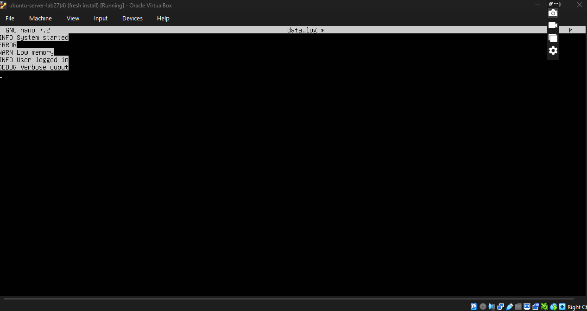
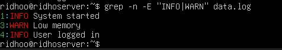

#  Pencarian Pola dengan grep
oke,berarti kita harus mencari baris yang mengandung “INFO” atau “WARN” di file: data.log

## 1.Pastikan file data.log ada di direktori saat ini:
```
ls
```
## 2.kalau tidak ada,kita buat dummy file dulu:
```
nano data.log
```
jika sudah tulis kode ini di data log nya:
```
INFO System started
ERROR Disk not found
WARN Low memory
INFO User logged in
DEBUG Verbose output
```


lalu Simpan dengan Ctrl+O → Enter → keluar Ctrl+X.

## 3. lalu ketik Syntax grep -E untuk pola alternatif
```
grep -n -E "INFO|WARN" data.log
```
lalu hasilnya seperti ini:


## 4. PENJELASAN
-E → mengaktifkan Extended Regular Expression (ERE)
| → simbol alternatif (OR)
-n → tampilkan baris nomor
"INFO|WARN" → artinya cari baris yang mengandung “INFO” atau “WARN”
data.log → nama file yang dicari

## 5. OPSIONAL 
Buat hasil tidak sensitif huruf besar/kecil:
```
grep -i -E "INFO|WARN" data.log
```


